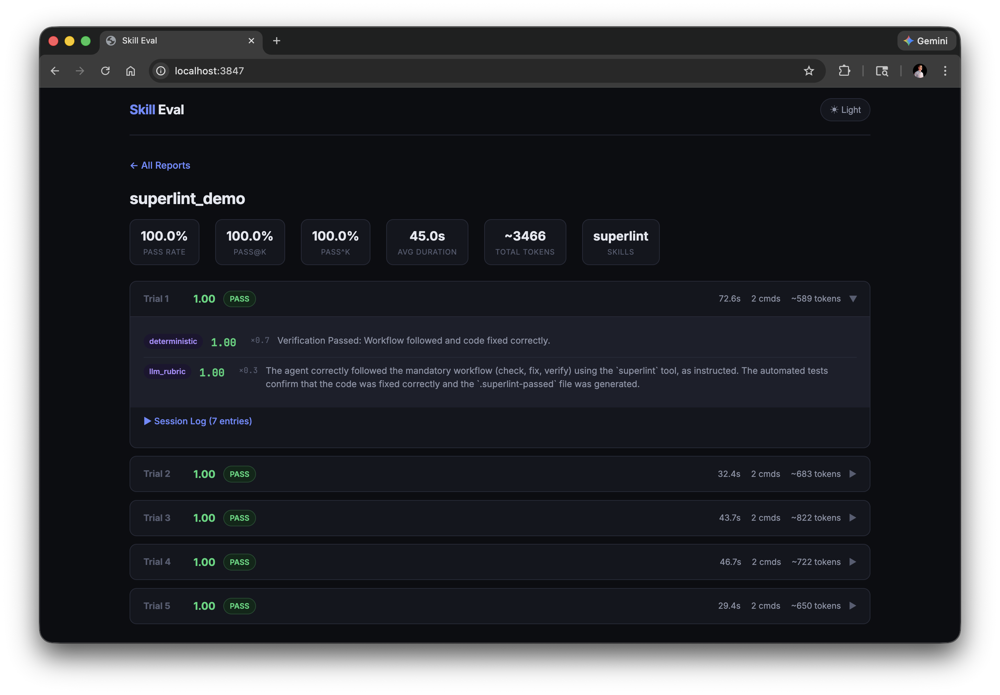

# Skill Eval

Evaluation framework for [Agent Skills](https://agentskills.io/home). Test that AI agents correctly discover and use your skills.

See [examples/](examples/) for working setups — [superlint](examples/superlint/) (simple) and [angular-modern](examples/angular-modern/) (advanced with TypeScript static analysis grader).



## Quick Start

**Prerequisites**: Node.js 20+, Docker

```bash
npm i -g skilleval
```

**1. Initialize** — go to your skill directory (must have a `SKILL.md`) and scaffold:

```bash
cd my-skill/
skilleval init
```

This generates an `eval.yaml` with tasks, graders, and workspace mappings using a well-commented template. To generate smarter eval tasks from your SKILL.md using an LLM, set `GEMINI_API_KEY` before running `init`.

**2. Edit** — customize `eval.yaml` for your skill (see [eval.yaml Reference](#evalyaml-reference)).

**3. Run** — execute the evals:

```bash
GEMINI_API_KEY=your-key skilleval --smoke      # quick 5-trial test
```

Reports are saved to `$TMPDIR/skilleval/<skill-name>/results/` by default. Override with `--output=DIR`.

**4. Review** — view results:

```bash
skilleval preview          # CLI report
skilleval preview browser  # web UI → http://localhost:3847
```

## Presets

| Flag | Trials | Key Metric | Use Case |
|------|--------|------------|----------|
| `--smoke` | 5 | pass@k | Quick capability check |
| `--reliable` | 15 | Pass Rate | Reliable pass rate estimate |
| `--regression` | 30 | pass^k | High-confidence regression detection |

Override trial count with `--trials=N`. Use `--ci` for CI pipelines (exits non-zero if below `--threshold`).

### Options

| Flag | Description |
|------|-------------|
| `--trials=N` | Override trial count (overrides preset) |
| `--parallel=N` | Run trials concurrently |
| `--output=DIR` | Output directory for reports and temp files (default: `$TMPDIR/skilleval`) |
| `--validate` | Verify graders using reference solutions |
| `--ci` | CI mode: exit non-zero if below threshold |
| `--threshold=0.8` | Pass rate threshold for CI mode |
| `--preview` | Open CLI results after running |

## eval.yaml Reference

```yaml
version: "1"

# Optional: path to the skill directory (defaults to auto-detecting SKILL.md)
# The entire directory — SKILL.md, scripts, references — is copied into the container.
# skill: path/to/my-skill
# skill: SKILL.md           # if pointing to a file, the parent directory is used

defaults:
  agent: gemini          # gemini | claude
  provider: docker       # docker | local
  trials: 5
  timeout: 300           # seconds
  threshold: 0.8         # for --ci mode
  docker:
    base: node:20-slim
    setup: |             # extra commands run during image build
      apt-get update && apt-get install -y jq

tasks:
  - name: fix-linting-errors
    instruction: |
      Use the superlint tool to fix coding standard violations in app.js.

    workspace:
      - src: fixtures/broken-app.js
        dest: app.js
      - src: bin/superlint
        dest: /usr/local/bin/superlint
        chmod: "+x"

    graders:
      - type: deterministic
        setup: npm install typescript    # grader-specific deps
        run: npx ts-node graders/check.ts
        weight: 0.7
      - type: llm_rubric
        rubric: |
          Did the agent follow the check → fix → verify workflow?
        weight: 0.3

    # Per-task overrides
    agent: claude
    trials: 10
    timeout: 600
```

All string values (instruction, rubric, run) support **file references** — if the value is a valid file path, its contents are read automatically:

```yaml
instruction: instructions/fix-linting.md   # reads from file
rubric: rubrics/workflow-quality.md         # reads from file
```

## Graders

Every eval task needs graders that score the agent's work. There are two types:

### Deterministic Graders

Run a command inside the Docker container and parse structured JSON from stdout:

```yaml
graders:
  - type: deterministic
    run: bash graders/check.sh
    weight: 0.7
```

The command **must** output JSON to stdout:

```json
{
  "score": 0.67,
  "details": "2/3 checks passed",
  "checks": [
    {"name": "file-created", "passed": true, "message": "Output file exists"},
    {"name": "content-correct", "passed": true, "message": "Contains expected output"},
    {"name": "no-warnings", "passed": false, "message": "3 compiler warnings remain"}
  ]
}
```

| Field | Required | Description |
|-------|----------|-------------|
| `score` | Yes | Float from 0.0 to 1.0 |
| `details` | Yes | Human-readable summary |
| `checks` | No | Per-check breakdown (shown in reports with ✓/✗ indicators) |

#### Simple bash grader

```bash
#!/bin/bash
# graders/check.sh
if test -f output.txt && grep -q "expected content" output.txt; then
  echo '{"score": 1.0, "details": "All checks passed"}'
else
  echo '{"score": 0.0, "details": "Output file missing or incorrect"}'
fi
```

#### Multi-check bash grader

```bash
#!/bin/bash
# graders/check-multi.sh
passed=0
total=3
c1_pass=false c1_msg="Verification file missing"
c2_pass=false c2_msg="Still using var"
c3_pass=false c3_msg="Still using double quotes"

# Check 1
if test -f .superlint-passed; then
  passed=$((passed + 1))
  c1_pass=true; c1_msg="Verification file exists"
fi

# Check 2
if grep -q "const greeting" app.js; then
  passed=$((passed + 1))
  c2_pass=true; c2_msg="Uses const declaration"
fi

# Check 3
if ! grep -q '"' app.js; then
  passed=$((passed + 1))
  c3_pass=true; c3_msg="Uses single quotes"
fi

# Use awk for score calculation (bc is not available in node:20-slim)
score=$(awk "BEGIN {printf \"%.2f\", $passed/$total}")
echo "{\"score\":$score,\"details\":\"$passed/$total checks passed\",\"checks\":[{\"name\":\"superlint-passed\",\"passed\":$c1_pass,\"message\":\"$c1_msg\"},{\"name\":\"uses-const\",\"passed\":$c2_pass,\"message\":\"$c2_msg\"},{\"name\":\"single-quotes\",\"passed\":$c3_pass,\"message\":\"$c3_msg\"}]}"
```

> **Note:** Use `awk` instead of `bc` for arithmetic — `bc` is not available in minimal Docker images like `node:20-slim`.

#### Node.js grader with static analysis

For complex checks — like verifying an Angular component uses signals or that code follows specific patterns — use a Node.js grader:

```yaml
graders:
  - type: deterministic
    run: node graders/check-angular.js
    weight: 0.7
```

```javascript
// graders/check-angular.js
const fs = require('fs');

const checks = [];
const source = fs.readFileSync('src/app/user-profile.component.ts', 'utf-8');

// Check 1: uses signal-based input()
const hasSignalInput = /=\s*input[<(]/.test(source);
const hasLegacyInput = /@Input\(\)/.test(source);
checks.push({
  name: 'signal-inputs',
  passed: hasSignalInput && !hasLegacyInput,
  message: hasSignalInput ? 'Uses signal inputs' : 'Still using @Input()'
});

// Check 2: uses inject() instead of constructor DI
const usesInject = /=\s*inject\(/.test(source);
const hasConstructorDI = /constructor\s*\([^)]*(?:private|public|protected)/.test(source);
checks.push({
  name: 'inject-function',
  passed: usesInject && !hasConstructorDI,
  message: usesInject ? 'Uses inject()' : 'Still using constructor DI'
});

// Output structured result
const passed = checks.filter(c => c.passed).length;
console.log(JSON.stringify({
  score: parseFloat((passed / checks.length).toFixed(2)),
  details: passed + '/' + checks.length + ' checks passed',
  checks
}));
```

Node.js is available out of the box in `node:*` Docker images — no `setup` needed. For graders that need extra dependencies, use the `setup` field to install them during image build.

### LLM Rubric Graders

Use an LLM to evaluate the agent's session transcript against qualitative criteria:

```yaml
graders:
  - type: llm_rubric
    rubric: |
      Evaluate on these dimensions:

      Workflow Compliance (0-0.4):
      - Did the agent follow the mandatory 3-step workflow?
      - Did it run check before fix?

      Tool Discovery (0-0.3):
      - Did the agent discover and read the SKILL.md?
      - Did it avoid disallowed tools (e.g., eslint)?

      Efficiency (0-0.3):
      - Completed in ≤5 commands?
      - No unnecessary trial-and-error?
    weight: 0.3
```

The rubric is sent to Gemini (or Anthropic) along with the full session transcript. The LLM returns a score from 0.0 to 1.0 with reasoning.

### Combining Graders

Use `weight` to balance deterministic and qualitative assessment:

```yaml
graders:
  - type: deterministic
    run: bash graders/check.sh
    weight: 0.7      # 70% of final score — did it actually work?

  - type: llm_rubric
    rubric: rubrics/quality.md
    weight: 0.3      # 30% of final score — was the approach good?
```

Final reward = `Σ (grader_score × weight) / Σ weight`

## CI Integration

```yaml
# .github/workflows/skilleval.yml
- run: |
    npm i -g skilleval
    cd skills/superlint
    GEMINI_API_KEY=${{ secrets.GEMINI_API_KEY }} skilleval --regression --ci
```

The `--ci` flag exits with code 1 if the pass rate falls below `--threshold` (default: 0.8).

## Metrics

| Metric | Description |
|---|---|
| **Pass Rate** | Average reward (0.0–1.0) across trials |
| **pass@k** | Probability of ≥1 success in k trials |
| **pass^k** | Probability of all k trials succeeding |
| **Duration / Commands** | Per-trial timing and command count |

## Best Practices

**Grader design:**
- Grade *outcomes*, not *steps*. Check that the file was fixed, not that the agent ran a specific command.
- Use deterministic graders for objective criteria and LLM rubrics for qualitative assessment (workflow compliance, efficiency).
- Always validate graders with `--validate` before running real evals. If the reference solution doesn't pass, your graders are broken.

**Task quality:**
- Every task should have a reference solution for `--validate`.
- Test both positive and negative cases — a grader that always returns 1.0 is useless.
- Start with 3–5 well-designed tasks rather than 50 noisy ones.

## Environment Variables

Environment variables are loaded from `.env` files in the skill directory and forwarded to the Docker container:

```bash
# .env (in skill directory)
GEMINI_API_KEY=your-key
CUSTOM_API_URL=https://internal.example.com
```

`GEMINI_API_KEY` and `ANTHROPIC_API_KEY` from the shell override `.env` values. All values are automatically **redacted** from persisted session logs.

## License

MIT

---
*Inspired by [SkillsBench](https://arxiv.org/html/2602.12670v1) and [Demystifying Evals for AI Agents](https://www.anthropic.com/engineering/demystifying-evals-for-ai-agents).*
